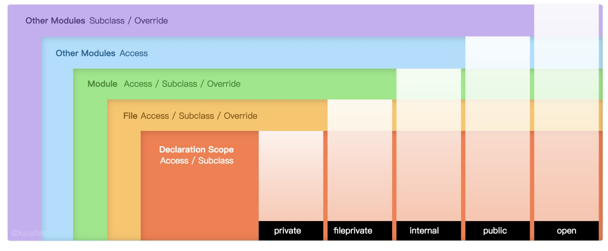
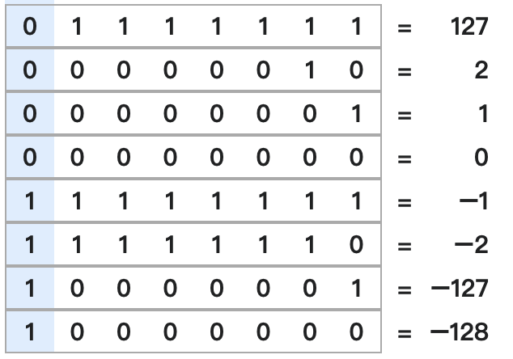

# ***Swift Note***

## Table of Content

[self vs Self](#self)

[Enum](#enum)

[Escape Char](#EscapeChar) 

[Singleton](#Singleton)

[Date Formatter](#DateFormatter)

[String Format](#StringFormat)

[Number Formatter](#NumberFormatter)

[Error Handling](#ErrorHandling)

[Delay Method](#DelayMethod)

[Access Control](#AccessControl)

[Lazy vs Computed Property](#LazyComputed)

[Read-Only Property](#ReadOnly)

[Substring](#Substring)

[Range Expression](#RangeExpression)

[Control Transfer](#ControlTransfer)

[Higher Order Function](#HigherOrderFunction)

[Where Clause](#whereClause)

[Numeric Literal](#NumericLiteral)

[2's Complement](#2Complement)

[Bitwise Operation](#BitwiseOperation)

<br>

## _**self vs Self**_ {#self}
Self is Type, while self is Instance.
```Swift
extension BinaryInteger {
    func squared() -> Self {
}
```
 <br>

## ***Enum*** {#enum}
```Swift
enum Compass: Int {
    case N = 0
    case E = 90
    case S = 180
    case W = 270

    init(degree: Int) {
        let reminder = degree % 360
        switch reminder {
            case 45..<135: self = .E
            case 135..<225: self = .S
            case 225..<315: self = .W
            default: self = .N
        }    
    }
}

extension Compass: CustomStringConvertible {
    var description: String {
        switch self {
            case .N: return "North"
            case .E: return "East"
            case .S: return "South"
            case .W: return "West"
        }
    }
}

extension Compass {
    init?(direction: String) {
        switch direction.lowercased() {
            case Compass.N.description.lowercased(): self = .N
            case Compass.E.description.lowercased(): self = .E
            case Compass.S.description.lowercased(): self = .S
            case Compass.W.description.lowercased(): self = .N
            default: return nil
        }
    }
}

extension Compass: CaseIterable {}

let east = Compass.E
print(east.rawValue)
print(Compass.allCases)
```

>`90`\
>`[North, East, South, West]`

 <br>

## ***Escape Character*** {#EscapeChar}

| String | Meaning |
|---|---|
| \0 | null character|
| \\\ | backslash |
| \t  | horizontal tab |
| \n | line feed |
| \r | carriage return |
| \\" | double quotation mark |
| \\' | single quotation mark |
| \u{n} | Unicode scalar value, where n is a 1 – 8 digit hexadecimal number |

<br>

## ***Singleton*** {#Singleton}
```Swift
class TheOnlyOneObject {
    private init() {}
    static let shared = TheOnlyOneObject()
}
```

<br>

## ***Date Formatter*** {#DateFormatter}
```Swift
let dateFormatter = DateFormatter()
dateFormatter.dateFormat = "yyyy-MM-dd"
let date = Date()
print(dateFormatter.string(from: date))
```
> `2022-12-31`

| Date Format | Output |
|---|---|
| EEEE, MMM d, yyyy | Wednesday, Sep 12, 2018 |
| MM/dd/yyyy | 09/12/2018 |
| MM-dd-yyyy HH:mm | 09-12-2018 14:11 |
| MMM d, h:mm a | Sep 12, 2:11 PM |
| MMMM yyyy | September 2018 |
| MMM d, yyyy | Sep 12, 2018 |
| E, d MMM yyyy HH:mm:ss Z | Wed, 12 Sep 2018 14:11:54 +0000 |
| yyyy-MM-dd'T'HH:mm:ssZ | 2018-09-12T14:11:54+0000 |
| dd.MM.yy | 12.09.18 |
| HH:mm:ss.SSS | 10:41:02.112 |
| HH:mm a | 01:23 am |

<br>

## ***String Format*** {#StringFormat}
```Swift
let one = 1
print(String(format: "Your ticket number is %03d.", one))
```
> `Your ticket number is 001.`

<br>

```Swift
let pi = Double.pi
print((String(format: "Pi approximates to %.3f.", pi)))
```
> `Pi approximates to 3.142.`

<br>

```Swift
let name = "Swift"
print((String(format: "Hi, my name is %@.", name)))
```
> `Hi, my name is Swift.`

<br>

```Swift
let max = Double.greatestFiniteMagnitude
print((String(format: "The largest number in double-precision is about %e", max)))
```
> `The largest number in double-precision is about 1.797693e+308.`

<br>

## ***Number Formatter*** {#NumberFormatter}
```Swift
let number: NSNumber = 1234.56789
let formatter = NumberFormatter()
formatter.locale = Locale(identifier: "en_GB") // Locale.current
formatter.numberStyle = .currency
print(formatter.string(from: number))
```
> `£1,234.57`


| numberStyle | Output |
|---|---|
| .none | 1235 |
| .decimal | 1,234.568 |	
| .percent | 123,457% |
| .scientific | 1.23456789E3 |
| .spellOut | one thousand two hundred thirty-four point five six seven eight nine |
| .ordinal | 1,235th |

[Apple Locale IDs](https://developer.apple.com/library/archive/documentation/MacOSX/Conceptual/BPInternational/LanguageandLocaleIDs/LanguageandLocaleIDs.html)

<br>

## ***Error Handling*** {#ErrorHandling}
```Swift
enum AdminLoginError: Error, CustomStringConvertible {
    case userNotFound
    case passwordInvalid
    
    var description: String {
        switch self {
        case .userNotFound: return "User Not Found."
        case .passwordInvalid: return "Invalid Password."
        }
    }
}

extension String: LocalizedError {
    public var errorDescription: String? { return self }
}

func adminLogin(username: String, password: String) throws {
    guard !username.isEmpty && !password.isEmpty else { throw "Input Error." }
    guard username == "admin" else { throw AdminLoginError.userNotFound }
    guard password == "password" else { throw AdminLoginError.passwordInvalid }
    print("Login successful.")
}

func tryAdminLogin(username: String, with password: String) {
    do {
        try adminLogin(username: username, password: password)
    } catch let error as AdminLoginError {
        switch error {
        case .userNotFound: print("Sorry. \(error.description)")
        case .passwordInvalid: print("\(error.description) Please try again.")
        }
    } catch {
        print("\(error.localizedDescription) Please input correct login information.")
    }
}
```
<br>

```Swift
tryAdminLogin(username: "admin", with: "")
```
> `Input Error. Please input correct login information.`

<br>

```Swift
tryAdminLogin(username: "admin", with: "123456")
```
> `Invalid Password. Please try again.`

<br>

```Swift
tryAdminLogin(username: "addmin", with: "password")
```
> `Sorry. User Not Found.`

<br>

```Swift
tryAdminLogin(username: "admin", with: "password")
```
> `Login successful.`

<br>

## ***Delay Method*** {#DelayMethod}
```Swift
print(Date())
DispatchQueue.main.asyncAfter(deadline: .now() + 3.0) {
    print(Date())
}
```
>2020-01-01 16:26:23 +0000 <br> 2020-01-01 16:26:26 +0000

<br>

```Swift
print(Date())
let timer = Timer.scheduledTimer(withTimeInterval: 2.0, repeats: false) { timer in
    print(Date())
}
```
>2020-01-01 16:26:23 +0000 <br> 2020-01-01 16:26:26 +0000

<br>

```Swift
print(Date())
sleep(2)
print(Date())
```
>2020-01-01 16:26:23 +0000 <br> 2020-01-01 16:26:26 +0000

<br>
Timer method can be cancelled by timer invalidate method. <br>
DispatchQueue is the easier way to manage the block to different threads. <br>
Sleep method may cease the caller thread, which is commonly the main thread.

<br>

## ***Access Control*** {#AccessControl}

|Declaration|Access Level|
|---|---|
|**open**|Entities can be readand written by ***other module***|
|**public**|Entities can be read, written by ***other module***, but they can only be inherited or overridden by ***same module***|
|**internal**|Entities can only be read and written by ***same module***|
|**privatefile**|Entities can only be read and written by ***same code file***|
|**private**|Entities can only be read or written by ***same declared scope*** or extension in the same code file|



## ***Lazy vs Computed Property*** {#LazyComputed}
```Swift
class Circle {
    var radius: Double
    
    init(radius: Double) {
        self.radius = radius
    }

    lazy var lazyArea: Double = {
        return Double.pi * self.radius * self.radius
    }()
    
    var computedArea: Double {
        return Double.pi * self.radius * self.radius
    }
}

var radius = 2.0
let circle = Circle(radius: radius)
print("radius: \(radius)")
print("circle.lazyArea: \(circle.lazyArea)")
print("circle.computedArea: \(circle.computedArea)")

radius = 5
circle.radius = radius
print("\nradius: \(radius)")
print("circle.lazyArea: \(circle.lazyArea)")
print("circle.computedArea: \(circle.computedArea)")
```

>radius: 2.0
<span style="color:red">circle.lazyArea: 12.566370614359172 </span>
circle.computedArea: 12.566370614359172 <br>
radius: 5.0
<span style="color:red">circle.lazyArea: 12.566370614359172 </span>
circle.computedArea: 78.53981633974483

Lazy property will be initialised and calculated once when the object (holder) is created. While the computed property will be calculated everytime when it is called.

<br>

## ***Read-Only Property*** {#ReadOnly}
```Swift
class Lady {
    var name = "Betty"
    private var weight = "Secret"                   // No one know it other side the declared scope
    private(set) var favouriteFood = "Pinneapple"   // People will know that when they are in the same module
    public private(set) var bestFriend = "Buzz"     // Everyone know that even they are in other module
}
```

<br>

## ***Substring*** {#Substring}
```Swift
var myString = "Hello World"
print(myString.prefix(4))
```
> Hell

```Swift
print(myString.suffex(5))
```
> World

```Swift
print(myString.dropFirst(2))
```
> llo World

```Swift
print(myString.dropLast(2))
```
> Hello Wor

```Swift
let spaceIndex = myString.firstIndex(of: " ") ?? myString.endIndex
let firstWord = myString[..<spaceIndex]
print(firstWord)
```
> Hello

```Swift
let afterSpaceIndex = myString.index(spaceIndex, offsetBy: 1)
myString.insert(contentsOf: "Happy ", at: afterSpaceIndex)
print(myString)
```
> Hello Happy World

```Swift
print(myString[afterSpaceIndex...<myString.endIndex])
```
> Happy World

```Swift
myString.removeSubrange(...spaceIndex)
print(myString)
```
> Happy World

```Swift
let pappy = myString.replacingOccurrences(of: "H", with: "P")
print(pappy)
```
> Pappy World

<br>

## ***Range Expression*** {#RangeExpression}
```Swift
func checkInt(_ num: Int) {
    switch num {
        // Partial Range UpTo
        case ..<0: print("It is a negative number")
        // ~= means range.contains
        case let x where (0...0) ~= x: print("It is zero")
        // Closed Range
        case 1...Int.max: print("It is a positive number")
    default: print("Wow, you found something very interesting")
    }
}
```

<br>

## ***Control Transfer*** {#ControlTransfer}

|Statement|Condition|Description|
|---|---|---|
|**continue**|for-loop|stop current and do next iteration|
|**break**|for-loop|stop current loop|
|**fallthrough**|switch case|continue to check next case|
|**return**|function|exit current function and return to calling function|
|**throw**|function|stop current function with error, and propagate the error to enclosing scope until it is caught|

<br>

## ***Higher Order Function*** {#HigherOrderFunction}

### ***TLDR***

|Function|Description|
|---|---|
|[.map](#map)|Taking an operation to each element of an array, and returning an transformed array|
|[.compactMap](#compactMap)|Working same as *.map*, and filtering out all nil case|
|[.flatMap](#flatMap)|Working same as *.map*, and flattening the sequence/collection of the element|
|[.reduce](#reduce)|Interacting an initial value with each element of an array, and returning the interacted value |
|[.filter](#filter)|Filtering the element of an array according to provided condition, and returning a filtered array|
|[.sort](#sort)|Sorting the array in order of provided condition|
|[.sorted](#sorted)|Working same as *.sort*, and returning a sorted array|
|[.forEach](#forEachContains)|Working same as for-loop, except control transfer statement doesn't work inside forEach|
|[.contains](#forEachContains)|Checking the array if it contains the provided value|


### ***.map*** {#map}
```Swift
let countryCapital = ["UK": "London", "Germany": "Berlin", "France": "Paris", "Italy": "Rome"]
print(countryCapital.map({$0.key}))
print(countryCapital.map({$0.value}))
```
> ["Germany", "UK", "France", "Italy"]
["Berlin", "London", "Paris", "Rome"]


### ***.compactMap*** {#compactMap}
```Swift
let nums = ["1", "2", "Three", "4", "f"]
// Double("Three") -> nil, which will be neglected by compactMap
print(nums.compactMap({Double($0)}))
```
> [1.0, 2.0, 4.0]

### ***.flatMap*** {#flatMap}
```Swift
let helloWorld1 = [["Hello", "World"], ["Hello", "Swift"]]
// flatMap flatten the inner collection
print(helloWorld1.flatMap({$0}))
```
> ["Hello", "World", "Hello", "Swift"]

```Swift
let helloWorld2 = ["HelloWorld"]
// "HelloWorld" is considered as a sequence of characters
print(helloWorld2.flatMap({$0}))
```
> ["H", "e", "l", "l", "o", "W", "o", "r", "l", "d"]

### ***.reduce*** {#reduce}
```Swift
func partialSum(from m: Int, to n: Int) -> Int? {
    guard n > m else { return nil }
    // providing 0 as inital value, and accumulately add element on the initial value
    return (m...n).reduce(0, {$0 + $1})
}
print(partialSum(from: 0, to: 5))
```
> Optional(15)

### ***.filter*** {#filter}
```Swift
let integers = [1,2,3,4,5,6,7,8,9]
// filter all even numbers
print(integers.filter({$0 % 2 == 0}))
```
> [2, 4, 6, 8]

### ***.sort*** {#sort}
```Swift
var vowels = ["o", "a", "u", "i", "e"]
vowels.sort(by: <)
print(vowels)
```
> ["a", "e", "i", "o", "u"]

### ***.sorted*** {#sorted}
```Swift
var vowels = ["o", "a", "u", "i", "e"]
let sortedVowels = vowels.sorted(by: >)
print(vowels)
print(sortedVowels)
```
> ["o", "a", "u", "i", "e"]
["u", "o", "i", "e", "a"]

### ***.forEach .contains*** {#forEachContains}
```Swift
func vowelChecker(_ word: String) {
    var numOfVowel = 0
    word.forEach { char in
        if vowels.contains(String(char).lowercased()) {
            numOfVowel += 1
        }
    }
    print("There \(numOfVowel > 1 ? "are" : "is") \(numOfVowel) vowel\(numOfVowel > 1 ? "s" : "") inside the word, \(word.uppercased())")
}

vowelChecker("Apple")
```
> There are 2 vowels inside the word, Apple

<br>

## ***Where Clause*** {#whereClause}

### For-loop
```Swift
var evens = [Int]()
for i in (1...10) where i % 2 == 0 {
    evens.append(i)
}
print(evens)
```
> [2, 4, 6, 8, 10]

### Switch Case
```Swift
func examGrade(_ mark: Int?) -> String? {
    guard (0...100).contains(mark) else { return "Out of range"}
    switch mark {
    case let mark where mark >= 90: return "A"
    case let mark where mark >= 75: return "B"
    case let mark where mark >= 50: return "C"
    default: return "D"
    }
}
print(examGrade(75))
```
> B

### Generic Function
```Swift
func isEqual<T>(_ a: T, _ b: T) -> Bool where T: Equatable { a == b }
func isEqualWithoutWhere<T: Equatable>(_ a: T, _ b: T) -> Bool { a == b }
// Both functions are equally the same
```

### Switch Case
```Swift
func checkNum(_ num: Int) {
    switch num {
    case let x where x > 0: print("\(num) is a positive number")
    case let x where x < 0: print("\(num) is a negative number")
    default: print("It is zero")
    }
}
checkNum(Int.min)
```
> -9223372036854775808 is a negative number

### Extension
```Swift
extension Array where Element: Numeric {
    func sum() -> any Numeric {
        return self.reduce(0, +)
    }
}
print([1.1,2,3,4].sum())
```
> 10.1

### Do-Try-Catch
```Swift
enum MyError: Error {
    case connectionError(Int)
    case exceptionError(String)
}

func throwErrorFunction(_ error: Error) throws {
    throw error
}

do {
    try throwErrorFunction(MyError.connectionError(404))
} catch MyError.connectionError(let code) where code == 404 {
    // If it is 404, there is special catch
    print("URL Not Found")
} catch let error as MyError {
    // If it is myError, it will be caught here
    switch error {
    case .connectionError(let code): print("Connection Error (\(code))")
    case .exceptionError(let str): print("Exception error: \(str)")
    }
} catch {
    // general catch
    print(error.localizedDescription)
}
```
> URL Not Found

<br>

## ***Numeric Literal*** {#NumericLiteral}
```Swift
let decimalInteger = 37
let binaryInteger = 0b100101
let octalInteger = 0o45
let hexInteger = 0x25
// All values are 37

let binaryString = String(binaryInteger, radix: 2)
print("Binary \(binaryString) equals to decimal \(Int(binaryString, radix: 2)!).")

let octaString = String(octalInteger, radix: 8)
print("Octal \(octaString) equals to decimal \(Int(octaString, radix: 8)!).")

let hexString = String(hexInteger, radix: 16)
print("Hexadecimal \(hexString) equals to decimal \(Int(hexString, radix: 16)!).")
```

> Binary 100101 equals to decimal 37.
> Octal 45 equals to decimal 37.
> Hexadecimal 25 equals to decimal 37.

```Swift
let decimalExponent = 37e2
// 37 x 10^2 = 3,700

let hexExponent = 0x25p2
// 0x25 x 2^2 = 0x94 (148 in decimal)
```
<br>

## ***2's Complement*** {#2Complement}
Taking 2's complement onto an integer:
1. Converting the integer into binary number
2. Flipping each of bit inside the binary number 
3. Adding 1 onto the flipped number

Example: Taking 2's complement for 5.

|Step|8-bit representation|
|:-:|:-:|
|1.|00000101|
|2.|11111010|
|3.|11111011|


```Swift
// To show the 2's complement by using bitPattern
let signedInt: Int8 = -5
let bitPattern = UInt8(bitPattern: signedInt)
print(String(bitPattern, radix: 2))
```

> 11111011

<br>

Using 2's Complement method, the number of positive integer allowed to be stored inside data byte is less than that of negative integer.


<br>

## ***Bitwise Operation*** {#BitwiseOperation}

|p|q|p & q (AND)|p \| q (OR)|p ^ q (XOR)|
|---|---|:-:|:-:|:-:|
|**0**|**0**|0|0|0|
|**0**|**1**|0|1|1|
|**1**|**0**|0|1|1|
|**1**|**1**|1|1|0|

```Swift
let p: Int8 = 37    // 0010 0101
let q: Int8 = 14    // 0000 1110
```

### AND

|(AND)|Int8|Value|
|:-:|:-:|:-:|
|p|0010 0101|37|
|q|0000 1110|14|
|p&q|0000 0100|4|

```Swift
print(p&q)
```
> 100

### OR

|(OR)|Int8|Value|
|:-:|:-:|:-:|
|p|0010 0101|37|
|q|0000 1110|14|
|p\|q|0010 1111|47|

```Swift
print(p|q)
```
> 47

### XOR

|(XOR)|Int8|Value|
|:-:|:-:|:-:|
|p|0010 0101|37|
|q|0000 1110|14|
|p^q|0010 1011|43|

```Swift
print(p|q)
```
> 43

### NOT

|(NOT)|Int8|Value|
|:-:|:-:|:-:|
|x|0011 0010|50|
|~x|1100 1101|-51|

```Swift
let x: Int8 = 50
print(~x)
```
> -51

### Right Shift

|(Right)|Int8|Value|
|:-:|:-:|:-:|
|x|0011 0010|50|
|x >> 2|0000 1100|12|

```Swift
let x: Int8 = 50
print(x >> 2)   // Shift the bits to R.H.S
```
> 12

### Left Shift

|(Left)|Int8|Value|
|:-:|:-:|:-:|
|x|0011 0010|50|
|x << 2|1100 1000|56|

```Swift
let x: Int8 = 50
print(x << 2)   // Shift the bits to R.H.S
```
> 56

<br>
